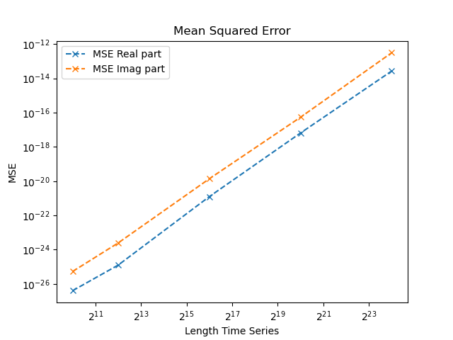
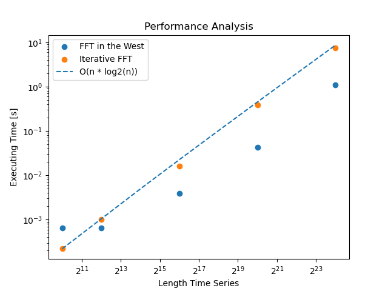

# Cooley-Tukey-Algorithm
This program implements the Cooley–Tukey FFT algorithm manually and compares its performance to the popular C++ FFT library "FFT in the West".

## Description Program
The program executes both algorithms and then prints the following information in the terminal:
```
Length array in log2: 20
MSE for real part: 6.54062e-18
MSE for imaginary part: 5.41377e-17
Time taken by FFTW: 0.0448927 seconds
Time taken by iterative FFT: 0.408199 seconds
```

## Validation Algorithm
To validate the performance of the self written iterative FFT algorithm the mean squared error of the real and imaginary parts are compared. It can be seen that the MSE of the imaginary part is higher compared to the real part. This can be explained by the signal form. It is also visualized that the MSE increases with the length of the time series. This is expected since more operations occur. In summary it can be said that the implementation of the inverse FFT algorithm is validated.




## Performance Analysis
By measuring the performance of the executing time of the respective algorithm one can get a feeling for the complexity. It can be nicely seen that the performance of the iterative FFT implementation follows O(n*log2(n)). This is as expected in literature. When looking at the performance of the "FFT in the West" algorithm one can say that especially for large time series significant performance increases can be expected.


